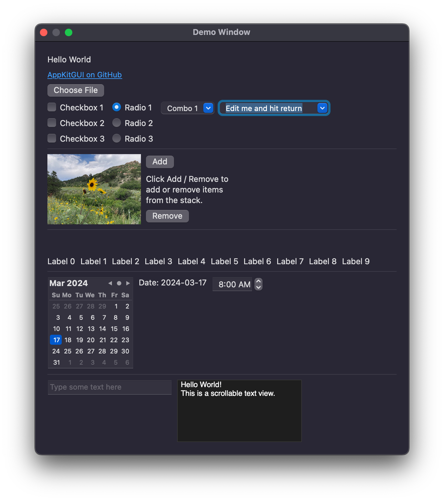

# AppKit GUI

This is an example project showing how to create a native macOS GUI application using Python and the [PyObjC](https://github.com/ronaldoussoren/pyobjc) bridge. It uses the native macOS [AppKit](https://developer.apple.com/documentation/appkit) framework to create a simple application that demonstrates the use of several GUI controls which are created programmatically.

## Why This Project

I wrote this to help me learn how to programmatically create a GUI application using native macOS controls without using XCode / Interface Builder. I could not find many examples of how to do this so I created this to help me learn how to do it. The usual way of building a Mac GUI app is to use [XCode and Interface Builder](https://developer.apple.com/xcode/) to create the GUI layout then connect code to the GUI controls. The layout is stored in a [NIB or XIB](https://en.wikipedia.org/wiki/Interface_Builder#Design) which is loaded by the app at startup. This significantly reduces boiler plate code in AppKit applications. It is possible to [load a NIB/XIB file in PyObjC](https://pyobjc.readthedocs.io/en/latest/tutorials/intro.html#the-nib-file) and this is what PyObjC encourages. For various reasons, I wanted to be able to create the entire application programmatically without using XCode and using a NIB/XIB file. This project demonstrates how to do so for a very basic app. This should be enough to get you started if you want to do something similar.

## Requirements

Requires Python 3.9 or later and the [PyObjC](https://github.com/ronaldoussoren/pyobjc) bridge. You can install PyObjC using pip:

```bash
pip3 install -r requirements.txt
```

## Usage

Run the script:

```bash
python3 example.py
```

The `example.py` script imports several helper functions from `appkitgui.py` which are used to help create and manage the views and controls.

## Screenshot

The project creates a single window with a few controls that looks like this:



The controls will fire user-definable actions when clicked or activated.

## PyObjC Notes

This project uses the [PyObjC](https://github.com/ronaldoussoren/pyobjc) framework by [Ronald Oussoren](https://github.com/ronaldoussoren). PyObjC acts as a bridge between Python and the native macOS Objective-C frameworks. PyObj is well maintained and kept current for the latest macOS releases however the documentation can be somewhat sparse and out of date. Some of what I needed to learn to create this project was done through trial and error and so I'm documenting it here for future reference. This is not intended to be a comprehensive guide to PyObjC but rather a collection of notes that I found useful.

### Naming Conventions

Objective-C objects communicate with each other using messages. Parts of the message, termed "selectors" are used to identify the method to be called and are interleaved with the arguments. For example, the following Objective-C message calls the `initWithContentRect:styleMask:backing:defer:` method on the `NSWindow` class:

```objc
self.window = [[NSWindow alloc] initWithContentRect:NSMakeRect(0, 0, 600, 600)
    styleMask:NSWindowStyleMaskTitled | NSWindowStyleMaskClosable | NSWindowStyleMaskResizable | NSWindowStyleMaskMiniaturizable
    backing:NSBackingStoreBuffered
    defer:NO];
```

PyObjC converts the Objective-C selectors into Python method names by removing the colons and replacing them with underscores. As each selector takes an argument, the number of underscores in the method name indicates the number of arguments. For example, the `initWithContentRect:styleMask:backing:defer:` method is converted to `initWithContentRect_styleMask_backing_defer_` in Python. This takes four arguments (the `self` argument is implicit) and so has four underscores.

```python
self.window = NSWindow.alloc().initWithContentRect_styleMask_backing_defer_(
    NSMakeRect(0, 0, 600, 600),
    NSWindowStyleMaskTitled
    | NSWindowStyleMaskClosable
    | NSWindowStyleMaskResizable,
    NSBackingStoreBuffered,
    False,
)
```

### Memory Management

Note in the example above the call to `alloc()` before the call to `initWithContentRect_styleMask_backing_defer_()`. Objective-C classes are created using the `alloc()` method and are then initialized using `init()` or another initialization method. These are roughly analogous to the `__new__()` and `__init__()` methods in Python but unlike in Python, they must be explicitly called.

Unlike Python, which is garbage collected, Objective-C uses reference counting to manage memory. In Objective-C, you use `retain()` to increment the reference count and `release()` to decrement it. When the reference count reaches zero, the object is deallocated. PyObjC manages this for you and so you don't need to call `retain()` or `release()` directly. If you need more fine-tuned control over the memory management, you can use [objc.autorelease_pool](https://pyobjc.readthedocs.io/en/latest/api/module-objc.html#objc.autorelease_pool) to create an autorelease pool context manager.

```python
with autorelease_pool():
    pass
```

### Calling Python Methods from Objective-C

In an AppKit app, there are many cases where the Objective-C object may call a Python class method. For example, the `action` or callback method for button is called when a button is clicked. In order for this to work the Python class method being passed to the Objective-C object must match the signature of the expected Objective-C method and must be named using the Objective-C naming conventions.

For example,

```python
self.button = NSButton.buttonWithTitle_target_action_(
    "Choose File", self, self.chooseFile_
)
```

`NSButton` expects the action method take a single argument (the `NSButton` instance). Thus in PyObjc, the method must be named with a single underscore. For example:

```python
def chooseFile_(self, sender):
    pass
```

which is equivalent to an Objective-C selector named `chooseFile:`.

If you prefer to use a more Pythonic method name, you can decorate the target method with the `@objc.method` decorator. For example:

```python
@objc_method(selector=b"chooseFile:")
def choose_file(self, sender):
    pass
```

In this case, PyObjC will handle the conversion of the method name to the Objective-C naming convention.  The `action` argument may be either a Python method or the str containing the name of the selector (method) to be called. For example, in the above example, the following are equivalent:

```python
self.button = NSButton.buttonWithTitle_target_action_(
    "Choose File", self, self.choose_file
)
```

```python
self.button = NSButton.buttonWithTitle_target_action_(
    "Choose File", self, "chooseFile:"
)
```

If you need to call a Python method from a class which inherits from an Objective-C class, you must follow the Objective-C naming conventions or use the `@python_method` decorator.

```python
    @python_method
    def create_window(self) -> NSWindow:
        pass
```

In this example, the `create_window()` method is called from a class which inherits from `NSObject`. Objective-C would expect the method to be passed one argument due to the underscore in the name. Adding the `@python_method` decorator tells PyObjC to ignore the naming convention and call the method as-is.

### Layout

In AppKit, [views and controls](https://developer.apple.com/documentation/appkit/views_and_controls?language=objc) are the building blocks of an app. Controls are specialized views that allow the user to interact with the app or display data (a button for example). Views and controls can be arranged by specifying the coordinates and the size of each view or control (a frame rectangle). Views can also contain other views. For example, the following code creates a window of size 200x200 and adds button with a frame rectangle at coordinates 50, 0 with width of 100 and height of 50 then adds it to the window. Note than on macOS, the view coordinate system has the origin at the bottom left corner of the view.

```python
window = (
    NSWindow.alloc()
    .initWithContentRect_styleMask_backing_defer_(
        NSMakeRect(0, 0, 200, 200),
        NSTitledWindowMask,
        NSBackingStoreBuffered,
        False,
    )
    .autorelease()
)
window.cascadeTopLeftFromPoint_(NSMakePoint(20, 20))

button = NSButton.alloc().initWithFrame_(NSMakeRect(50, 0, 100, 50))
button.setBezelStyle_(1)
button.setTitle_("Choose File")
button.setTarget_(window)
window.contentView().addSubview_(button)
```

This works fine for very simple windows but it becomes difficult to manage when you have many views and controls or need to account for resizing, etc. To make layout easier, AppKit includes several other classes that can be used to [layout views and controls](https://developer.apple.com/documentation/appkit/view_layout?language=objc). This project makes use of the [NSStackView](https://developer.apple.com/documentation/appkit/nsstackview?language=objc) which allows you to arrange views and controls in a horizontal or vertical stack. The following code creates a window with a vertical stack view and adds a button to it. The stack view will automatically arrange the button so it is centered between left/right edges of the window and move the button to maintain position when the window is resized.

```python
window = (
    NSWindow.alloc()
    .initWithContentRect_styleMask_backing_defer_(
        NSMakeRect(0, 0, 200, 200),
        NSWindowStyleMaskClosable
        | NSWindowStyleMaskResizable
        | NSWindowStyleMaskTitled,
        NSBackingStoreBuffered,
        False,
    )
    .autorelease()
)
window.cascadeTopLeftFromPoint_(NSMakePoint(20, 20))

vstack = NSStackView.stackViewWithViews_(None)
vstack.setOrientation_(NSUserInterfaceLayoutOrientationVertical)
vstack.setDistribution_(NSStackViewDistributionFillEqually)
vstack.setAlignment_(NSLayoutAttributeCenterX)
window.contentView().addSubview_(vstack)
vstack.topAnchor().constraintEqualToAnchor_(
    vstack.superview().topAnchor()
).setActive_(True)
vstack.leftAnchor().constraintEqualToAnchor_(
    vstack.superview().leftAnchor()
).setActive_(True)
vstack.rightAnchor().constraintEqualToAnchor_(
    vstack.superview().rightAnchor()
).setActive_(True)
button = NSButton.buttonWithTitle_target_action_("Choose File", None, None)
vstack.addArrangedSubview_(button)
```

Comparing the two examples, the second one takes a bit more work to set up but once the layout constraints are set, the stack view will automatically handle resizing and positioning of the controls. The stack view also makes it easy to add additional views and controls to the window.

This project makes use of `NSStackView` to layout the controls in the window and provides several helper functions to simplify the creation of views and controls. For example, the above can be rewritten as:

```python
import appkitgui as akg

window = akg.window("Example", 200, 200)
main_view = akg.main_view(window)
button = akg.button("Choose File")
main_view.append(button)
```

AppKitGUI is not intended to be a complete GUI framework but it does vastly simplify the creation of simple GUI applications while allowing you to still access the AppKit objects directly.

### Properties

With PyObjC, properties on the Objective-C objects are usually accessed using getter and setter functions. The getter is the name of the property and the setter is `setProperty_` where `Property` is the name of the property with the first letter capitalized. For example, the `title` property of `NSButton` is accessed using the `title()` getter and `setTitle_()` setter.

## Implementation Notes

I'm certain there are better ways to do this. The AppKit framework provides many different ways to create and use native controls. I've experimented and found something that worked but it may not be optimal. I welcome any feedback or suggestions for improvement.

## Alternatives

- The [Toga](https://github.com/beeware/toga) framework from the [BeeWare](https://beeware.org/) project provides a cross-platform GUI toolkit for Python that uses native controls.
- [Rubicon-ObjC](https://github.com/beeware/rubicon-objc), also from the BeeWare project, provides an alternative bridge between Python and Objective-C. It is used by the Toga framework. Unlike PyObjc, Rubicon-ObjC works on iOS as well as macOS. My code targets only macOS and I am familiar with PyObjC, which is more mature, so I chose to use it for this project.

## References

- The [Minimalist Cocoa Programming](https://www.cocoawithlove.com/2010/09/minimalist-cocoa-programming.html) article was helpful for understanding how to create a minimal Cocoa application.
- [PyObjC documentation](https://pyobjc.readthedocs.io/en/latest/index.html)
- The [Apple Auto Layout Guide](https://developer.apple.com/library/archive/documentation/UserExperience/Conceptual/AutolayoutPG/index.html#//apple_ref/doc/uid/TP40010853-CH7-SW1) is worth studying to understand how layout constraints work.
- [Apple AppKit Framework Reference](https://developer.apple.com/documentation/appkit)
- [An Epic Introduction to PyObjC and Cocoa](https://lethain.com/an-epic-introduction-to-pyobjc-and-cocoa/)

## LICENSE

MIT License
